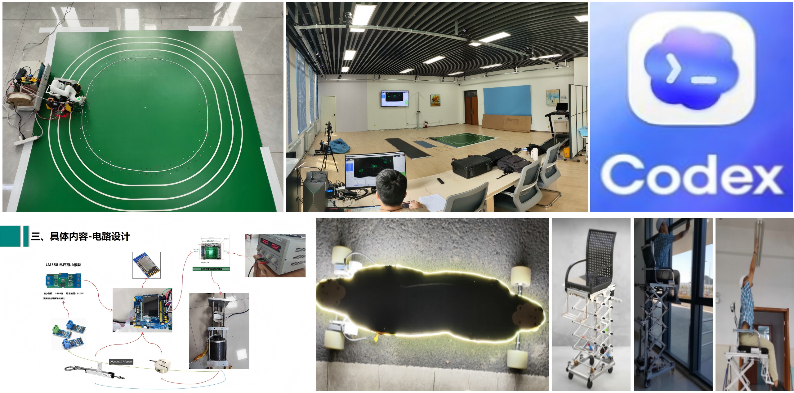

---
AIGC:
    Label: "1"
    ContentProducer: 001191440300708461136T1XGW3
    ProduceID: ea2f37d43cca56d04dfb4cf037af349a_ca9c2a46697311f1a0095254002afed2
    ReservedCode1: M9QkPWnjvmQG5zB/PXiNGMhxlMH+voZ8sVYyfbju/CcFOBGpx9XYahcd5BubY23NgVgu8Li7iCdcz49+qY1mu3OA9+n3UGzPfwJMXcyWryWjz0FyYHF7bMh4D3JQLj/cJfDAWnTpTCbg46trM5EqPJkszGZ6cnMinlQ7IFK2PKXtuPX9OZaRPozw39E=
    ContentPropagator: 001191440300708461136T1XGW3
    PropagateID: ea2f37d43cca56d04dfb4cf037af349a_ca9c2a46697311f1a0095254002afed2
    ReservedCode2: M9QkPWnjvmQG5zB/PXiNGMhxlMH+voZ8sVYyfbju/CcFOBGpx9XYahcd5BubY23NgVgu8Li7iCdcz49+qY1mu3OA9+n3UGzPfwJMXcyWryWjz0FyYHF7bMh4D3JQLj/cJfDAWnTpTCbg46trM5EqPJkszGZ6cnMinlQ7IFK2PKXtuPX9OZaRPozw39E=
---

  

<h1 align="center">Hi 👋, I'm Ruiguo Chen</h1>
<h3 align="center">Robotics & Embodied AI Engineer | Sensor Fusion | Full-Stack Prototyping</h3>

  <a href="README_CN.md">🇨🇳 中文</a>
  &nbsp;|&nbsp;
  <a href="mailto:1040889415@qq.com">📧 Email</a>
  &nbsp;|&nbsp;
  <a href="https://github.com/wojiaoCRG">🔗 GitHub</a>

---

## 📋 About Me

M.S. Candidate in Mechanical Engineering with **3+ years of hands-on experience** in vehicle-arm coordination, real-time sensor fusion, embedded control, and hardware-software integration. I build end-to-end systems spanning STM32 sensing, ROS/ROS2 data pipelines, optical motion capture, CAD/PCB/3D-printed prototypes, and PyTorch/OpenCV workflows.

- 🎯 **Target Role:** NVIDIA Full-Stack Solution Engineer – Sensorized Human
- 📍 **Location:** China
- 📅 **Availability:** July 2026
- 🔬 **Focus:** DexUMI-style human-to-robot skill transfer, demonstration datasets, imitation learning

  

---

## 🛠️ Core Skills

<table>
<tr>
<td width="18%"><b>🔧 Languages & Infra</b></td>
<td>Python, C++, STM32 HAL, CUDA, CMake, Bash/Shell, Git, GitHub Actions (CI/CD), Linux/Ubuntu, Docker, ROS/ROS2, ROS bag, tf2, Protobuf, MQTT, gRPC, YAML/JSON</td>
</tr>
<tr>
<td><b>🤖 Robotics & Control</b></td>
<td>Vehicle-arm coordination, kinematic/dynamic modeling, closed-loop control, trajectory planning, SLAM, URDF/xacro, RViz, MoveIt, Gazebo, Isaac Sim, ros2_control, sensor fusion (Vision, IMU, Odometry, MoCap), teleoperation, calibration</td>
</tr>
<tr>
<td><b>🧠 AI / Machine Learning</b></td>
<td>PyTorch, CUDA/TensorRT, OpenCV, Diffusion Models, Diffusion Policy, Behavior Cloning (BC), ACT, Imitation Learning pipelines, Domain Randomization, Sim2Real transfer, HuggingFace, ONNX, model fine-tuning & deployment</td>
</tr>
<tr>
<td><b>👤 Human Sensing & Motion</b></td>
<td>Optical MoCap (12-camera sub-mm), OpenPose/MediaPipe, SMPL/SMPL-X, motion retargeting, RGB-D cameras (RealSense, Azure Kinect), iPhone LiDAR/Record3D, human-to-robot skill transfer, DexUMI-style data pipelines</td>
</tr>
<tr>
<td><b>🔩 Hardware & Prototyping</b></td>
<td>SolidWorks, Fusion 360, PCB design, 3D printing, I2C/SPI/UART/CAN, PID control, FreeRTOS, JTAG/SWD, BMS/Power systems, motor driver tuning, force/displacement/current sensing, mechanical assembly, rapid prototyping</td>
</tr>
</table>

## 🚀 Featured Projects

### 1. Vehicle-Arm Coordinated Mobile Manipulation & Teleoperation Data Pipeline
*Project Lead · Sep 2023 – 2026*

  

  <a href="https://www.bilibili.com/video/BV1LBjV6kEPN/">📹 Watch on Bilibili: Mobile Robot Printing Demo</a>

- Modeled coupled kinematics of an **omnidirectional vehicle base + multi-DOF robotic arm** to solve SLAM drift, motion desynchronization, and real-time deviation compensation.
- Built a unified perception-control pipeline fusing **vision, IMU, odometry, voice, and motion capture** signals; recorded joint angles, end-effector poses, and deviation metrics for replay analysis.
- Developed a **ROS-bag data recording & replay workflow** extensible to human demonstration datasets for teleoperation, imitation learning, and diffusion-policy training.
- 🎯 **Results:** 22%–55% accuracy improvement on end-effector/path; fabricated a **1.2m × 1.2m** large-format thin-wall part.
- 📄 **Outputs:** 1 open-source project · 1 first-author EI paper · 1 granted utility patent.

---

### 2. High-Precision Motion Capture for Robot Trajectory Calibration
*Independent Research · Jul – Oct 2025*

  

  <a href="https://www.bilibili.com/video/BV1RBjV6rEYy/">📹 Watch on Bilibili: Motion Capture Demo</a>

- Operated a **12-camera optical MoCap system** (sub-millimeter precision) to record dynamic chassis and arm trajectories during printing.
- Time-synchronized **MoCap ground truth with onboard odometry & IMU**, enabling layer-by-layer error analysis and compensation.
- 🔄 **Transferable to human tracking:** spatial calibration, frame alignment, low-latency streaming, and kinematic mapping between operator motion and robot end-effector targets.

---

### 3. STM32-Based Force-Aware Linear Actuator Test Rig
*Bachelor Thesis · Feb – May 2023*

  

  <a href="https://www.bilibili.com/video/BV1HL41167A9/">📹 Watch on Bilibili: Motor Test Rig Demo</a>

- Designed and built a test platform measuring **linear motor displacement, voltage, output force, and current**.
- Implemented **STM32 HAL firmware** for real-time data acquisition, closed-loop control, sensor calibration, and experimental validation.
- 🔧 Groundwork for force measurement, signal conditioning, and deterministic embedded control — relevant to **tactile sensing & haptic feedback integration**.

---

### 4. Diffusion Transformer Fine-Tuning for Voice Conversion
*Independent Research · Apr – Jul 2025*

  
  

- Fine-tuned a **196M-parameter Diffusion Transformer + Length Regulator** in PyTorch across 13 epochs / 500 optimization steps, achieving ~50% loss reduction.
- 🧠 Strengthened diffusion-model debugging, sequence generation, training-loop design, and **reproducible Linux/Docker deployment** — directly transferable to diffusion-policy pipelines.

---

### 5. Rapid Mechatronic Prototypes: Electric Skateboard & Lift Chair
*Independent / Team Lead · Jun 2021 – Oct 2024*

  <a href="https://www.bilibili.com/video/BV1y51uYWEHZ/">📹 Watch on Bilibili: Electric Skateboard Demo</a>

  <a href="https://www.bilibili.com/video/BV18L4y1h7vY/">📹 Watch on Bilibili: Lift Chair Demo</a>

- **Electric Skateboard:** Full hardware integration — component selection → PCB fabrication → **10S2P battery pack assembly** → motor controller tuning → structural build. Reliable operation for 2+ years.
- **Smart Omnidirectional Lift Chair:** Led prototype with scissor-lift mechanism and hand-control interface, building human-centered design and full-stack electromechanical assembly skills.

---

## 📚 Publications & Patent

| Type | Title | Venue / ID | Year |
|------|-------|------------|------|
| 📄 **EI Journal (First Author)** | Research on Dual-tracking Strategy for Interlayer Deviation Optimization in Mobile Robot 3D Printing | *China Mechanical Engineering* | 2025 (Accepted) |
| 🔧 **Granted Utility Patent** | A Dual-tracking Continuous Mobile 3D Printing Device Based on Vision Sensing | ZL 2025 2 0638034.7 | 2026 |

---

## 🏭 Industry Experience

| Company | Role | Period |
|---------|------|--------|
| Ningbo Ronghong Auto Co. | Laser Cutting Operator | Jan – Feb 2021 |
| Yuhuan Tongfa Plastic Machinery Co. | Mechanical Drafter & Assembly Support | Jul – Sep 2021 |
| Songzheng Intelligent Co. | Industry-Education Project Lead | Feb – Apr 2022 |

- **Ronghong:** Converted product drawings into CAD layouts for sheet-metal laser cutting, nesting, inspection.
- **Tongfa:** Modeled sheet-metal housings for blow-molding equipment; production-line mechanical assembly & wiring.
- **Songzheng:** Led student team to model water-heater inner-tank production line and study electromechanical process flow.

---

## 🎓 Education

| School | Degree | Period |
|--------|--------|--------|
| **Xinjiang University** (211 / Double First-Class) | M.S. Mechanical Engineering — Vehicle-Arm Coordination | Sep 2023 – Jun 2026 |
| Taizhou University | B.Eng. Mechatronic Engineering — Machine Vision | Sep 2019 – Jun 2023 |

---

## 🏆 Honors & Awards

| Award | Level |
|-------|-------|
| Zhejiang Provincial Government Scholarship | 2020–2021, 2021–2022 |
| Xinjiang University Academic Scholarship | 2024, 2025 |
| 🥉 National 3rd Prize — 3D Digital Innovation Design Competition | National |
| 🥇 Provincial Grand Prize — 3D Digital Innovation Design Competition | Provincial |
| 🥈 Provincial 2nd Prize (×2) — 3D Digital Innovation Design Competition | Provincial |
| 🥈 Provincial 2nd Prize — Engineering Training & Mechanical Design Competition | Provincial |
| 🎖️ Outstanding Graduate of Zhejiang Province | 2023 |

---

## 🔭 Current Technical Focus

- **Isaac Sim / Omniverse:** Building Human-in-the-Loop simulation with MoCap-driven digital humans via Python API & ROS2 Bridge.
- **SMPL/SMPL-X:** Loading parametric body models, driving joints from AMASS datasets, visualizing in Isaac Sim.
- **Diffusion Policy:** Reproducing Stanford Diffusion Policy on vehicle-arm coordination data — from ROS-bag to action generation.
- **Low-Cost Data Pipeline:** iPhone Record3D → SMPL fitting → Isaac Sim retargeting → ROS2 streaming prototype.
- **Sim2Real Transfer:** Designing domain-randomized training environments and benchmarking real-robot policy transfer.

📊 **Skill Gap Analysis:** [SKILL_GAP_ANALYSIS.md](SKILL_GAP_ANALYSIS.md)
🗺️ **6-Month Roadmap:** [ROADMAP_6MONTH.md](ROADMAP_6MONTH.md)---
