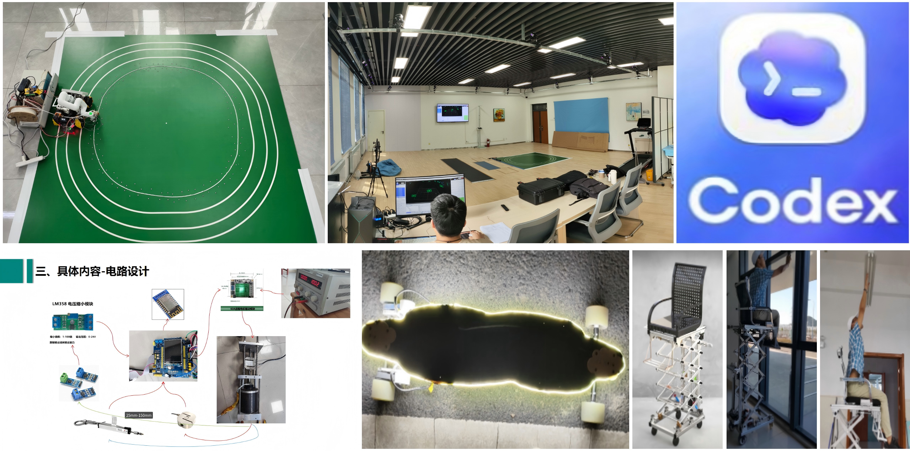

---
AIGC:
    Label: "1"
    ContentProducer: 001191440300708461136T1XGW3
    ProduceID: ea2f37d43cca56d04dfb4cf037af349a_661e57348b5a11f184f2525400e6dd8f
    ReservedCode1: bouxrVjF25yoXVtuvuX/qSXA/wpgG/OYZXN3bBvQGY1BoeAxdZbL1/I1HHJAvpeY3YQY/KotJH+48HQH1kfbjZ1XFIrD8YGV4xX//0HahhK/YHGvowDaANc8utKjm52m6faSsMjfS3zX6cIrwXV6nbayl/LwVKSwfKkawhYQbXgQvbVbDyv296dIhss=
    ContentPropagator: 001191440300708461136T1XGW3
    PropagateID: ea2f37d43cca56d04dfb4cf037af349a_661e57348b5a11f184f2525400e6dd8f
    ReservedCode2: bouxrVjF25yoXVtuvuX/qSXA/wpgG/OYZXN3bBvQGY1BoeAxdZbL1/I1HHJAvpeY3YQY/KotJH+48HQH1kfbjZ1XFIrD8YGV4xX//0HahhK/YHGvowDaANc8utKjm52m6faSsMjfS3zX6cIrwXV6nbayl/LwVKSwfKkawhYQbXgQvbVbDyv296dIhss=
---

# Ruiguo Chen — Mechanical Structure Engineer (Robotics)

[🇨🇳 中文](README.md)  |  [📧 Email](mailto:1040889415@qq.com)  |  [🔗 GitHub](https://github.com/wojiaoCRG)

211 Double First-Class M.S. in Mechanical Engineering, **3 years of experience in mobile robotic arm development**, 4 project experiences, 2 papers, 1 patent, 3 competitions. Proficient in SolidWorks and Creo/Pro-E with strong engineering drawing skills. Solid foundation in engineering mechanics and mechanics of materials, familiar with common engineering materials (aluminum alloys, steel, engineering plastics), their properties, manufacturing processes (CNC, 3D printing, sheet metal), and surface treatments. Capable of independently handling the entire workflow from conceptual design, detailed modeling, and engineering drawing to production tracking. Proficient in tolerance analysis and dimension chain calculation.

- 📍 Location: China
- 📅 Availability: July 2026
- 🔬 Focus: Robotic Structure Design / Mechatronics / Mobile Manipulators

---

## 🔧 Technical Skills

**🛠️ Mechanical Design**
SolidWorks, Pro/E (Creo), AutoCAD, 3D Modeling, Assembly Design, Engineering Drawing, Interference Checking, Motion Simulation, SolidWorks Simulation, FEA

**⚙️ Robotic Structures**
Mobile Chassis, Robotic Arm Joint Modules, End-Effectors, Sensor Mounts, Scissor-Lift Mechanisms, Wheeled Chassis, Biomimetic Locomotion, System-Level Design

**🏭 Manufacturing & Prototyping**
CNC Machining, 3D Printing, Sheet Metal, Welding, Turning/Milling/Drilling/Grinding, BOM Management, Tolerance Analysis, Dimension Chain Calculation, Component Selection, Cost Control, Prototype Assembly & Debugging

**💻 Development Tools**
Matlab/Simulink, Gazebo, Isaac Sim, C++, Python, STM32 HAL, Git, Docker, LCEDA, Blender, Mujoco, Unity 3D

---

## 🚀 Projects

### 1. Mobile 3D Printing Robot — System Design & Implementation

*Project Lead · Sep 2023 – Jun 2024*

[📹 Demo Video](https://www.bilibili.com/video/BV1LBjV6kEPN/)

- Led the **full-system mechanical design** of a mobile 3D printing robot, including the mobile chassis, robotic arm mounting bracket, sensor brackets, and end-effector interface — handling 3D modeling and assembly design of all key components
- Used SolidWorks and SolidWorks Simulation for complete 3D modeling and simulation, performing **interference checking, motion range verification, center-of-gravity analysis, and assembly process optimization**
- Contributed to end-effector structural design, adapting structures for printing and vision task scenarios with localized optimization
- 🎯 **Results**: Completed prototype assembly, debugging, and testing; resolved assembly interference and motion jamming issues; successfully printed a 1.2m large-format thin-wall component
- 📄 **Outputs**: 1 open-source project · 1 first-author EI paper · 1 granted utility patent

---

### 2. 3D Design Competition — Omnidirectional Lift Chair Structural Design & Prototype

*Project Lead · Jun 2024 – Oct 2024*

[📹 Demo Video](https://www.bilibili.com/video/BV18L4y1h7vY/)

- Responsible for the **complete mechanical design**, including omnidirectional mobile chassis, scissor-lift mechanism, seat support structure, motor mounts, and protective housing
- Used SolidWorks for detailed part modeling, full assembly, motion simulation, and interference checking to verify structural stability during lifting
- Completed **component selection** for drive wheels, motors, lead screws, scissor links, bearings, and fasteners, optimizing lift range, load capacity, and overall dimensions
- Participated in prototype fabrication, assembly, and debugging; resolved lift jamming, chassis drift, and structural wobble issues
- 🏆 **Result**: Achieved omnidirectional mobility with 2m max lift height; completed proof-of-concept verification; won **Zhejiang Provincial Grand Prize**

---

### 3. DIY "Somersault Cloud" Electric Skateboard — Mechanical & Control Integration

*Developer · Aug 2024 – Oct 2024*

[📹 Demo Video](https://www.bilibili.com/video/BV1y51uYWEHZ/)

- Completed the **mechanical layout design** of the skateboard, including motor positioning, deck dimensions, truck spacing, wheel assembly, battery compartment layout, and ESC mounting
- Participated in **component selection** for the motor, battery, ESC, remote controller, wheels, and fasteners, balancing power performance, range, and space constraints
- 🎯 **Result**: All motor and electronic component structures fit without mutual interference; validated through two years of actual use

---

### 4. Linear Motor Test Rig — Mechanical Structure & Control System Design

*Bachelor Thesis · Feb 2023 – May 2023*

[📹 Demo Video](https://www.bilibili.com/video/BV1HL41167A9/)

- Completed the **structural design** of the test rig, including sensor brackets, limit structures, and protective covers, fabricated using acrylic laser cutting
- Responsible for STM32 HAL firmware development, coding, debugging, and validation for real-time data acquisition and closed-loop control
- 🎯 **Result**: Linear motor test rig passed functional verification, displaying real-time current and voltage data on an LCD screen

---

### 5. High-Precision Motion Capture for Robot Trajectory Calibration

*Independent Research · Jul 2025 – Oct 2025*

[📹 Demo Video](https://www.bilibili.com/video/BV1RBjV6rEYy/)

- Operated a 12-camera optical MoCap system (sub-millimeter precision) to record dynamic chassis and arm trajectories during printing
- Time-synchronized MoCap ground truth with onboard odometry & IMU, enabling layer-by-layer error analysis and compensation
- 🔄 Transferable to human tracking: spatial calibration, frame alignment, low-latency streaming, and kinematic mapping between operator motion and robot end-effector targets

---

### 6. Diffusion Transformer Fine-Tuning for Voice Conversion

*Independent Research · Apr 2025 – Jul 2025*

- Fine-tuned a 196M-parameter Diffusion Transformer + Length Regulator in PyTorch across 13 epochs / 500 optimization steps, achieving ~50% loss reduction
- 🧠 Strengthened diffusion-model debugging, sequence generation, training-loop design, and reproducible Linux/Docker deployment capabilities

---

## 📄 Publications

| Type | Title | Venue / ID | Year |
|------|-------|-----------|------|
| **EI Journal (First Author)** | Research on Dual-Tracking Strategy for Interlayer Deviation Optimization in Mobile Robot 3D Printing | *China Mechanical Engineering* (IF 3.04) | 2025 (Published) |
| 🔧 **Granted Utility Patent** | A Dual-Tracking Continuous Mobile 3D Printing Device Based on Vision Sensing | ZL 2025 2 0638034.7 | 2026 |
| 📄 **Journal Paper (First Author)** | Research Status Analysis of Electroplastic-Assisted Machining of Difficult-to-Machine Materials | — | Published |

---

## 🏆 Awards

| Award | Level |
|-------|-------|
| Outstanding Graduate of Zhejiang Province | 2023 |
| 🥉 National 3rd Prize — 3D Digital Innovation Design Competition | National |
| 🥇 Provincial Grand Prize — 3D Digital Innovation Design Competition | Provincial |
| 🥈 Provincial 2nd Prize — National Engineering Training Competition | Provincial |
| 🥈 Provincial 2nd Prize — National Mechanical Design Competition | Provincial |
| 🥈 Provincial 2nd Prize — 3D Digital Innovation Competition | Provincial |
| 🥉 Provincial 3rd Prize — Zhejiang Physics Innovation Competition | Provincial |
| Zhejiang Provincial Government Scholarship | 2020–2021, 2021–2022 |
| Xinjiang University Academic Scholarship | 2024, 2025 |

---

## 🏭 Industry Experience

| Company | Role | Period | Highlights |
|---------|------|--------|------------|
| Ningbo Ronghong Auto Co. | Laser Cutting Operator | Jan–Feb 2021 | Sheet metal laser cutting, CAD layout & nesting, inspection |
| Yuhuan Tongfa Plastic Machinery Co. | Mechanical Drafter | Jul–Sep 2021 | 3D modeling of blow-molding machine sheet metal housings, assembly & wiring |
| Songzheng Intelligent Co. | Industry-Education Project Lead | Feb–Apr 2022 | Led team to 3D-model water-heater inner-tank production line |

---

## 🎓 Education

| School | Degree | Period |
|--------|--------|--------|
| **Xinjiang University** (211 / Double First-Class) | M.S. Mechanical Engineering — Mobile 3D Printing Robotics | Sep 2023 – Jun 2026 |
| Taizhou University | B.Eng. Mechatronic Engineering — Robotics | Sep 2019 – Jun 2023 |

---

> 📁 Previous version (Robotics Full-Stack Engineer) backup: [backup_robot_fullstack/](backup_robot_fullstack/)
*（内容由AI生成，仅供参考）*
